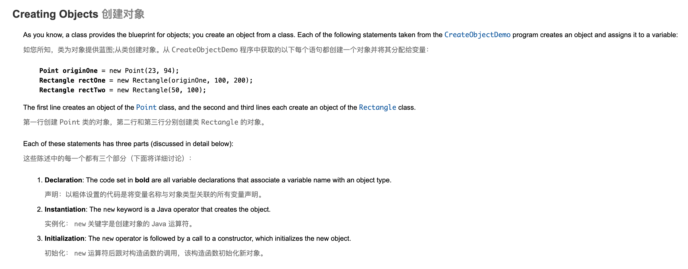
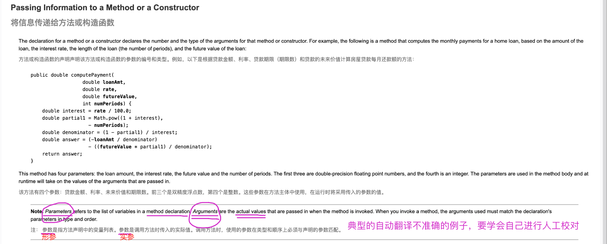
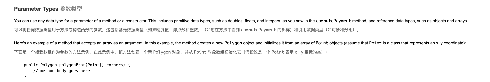
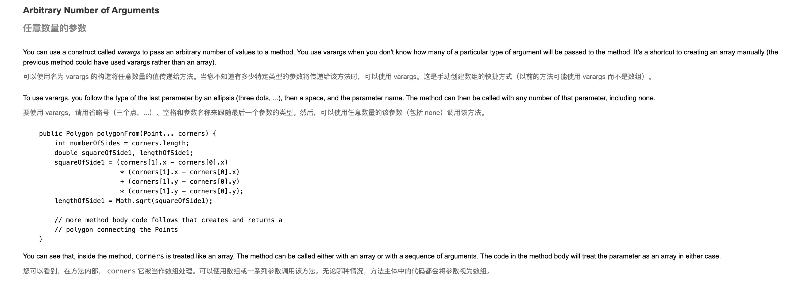
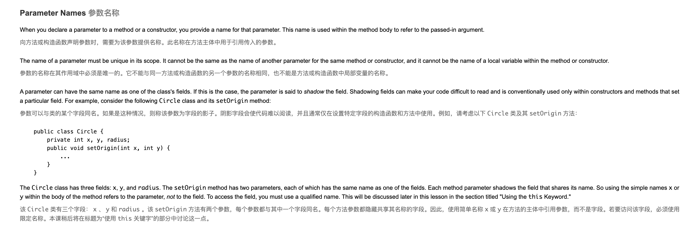
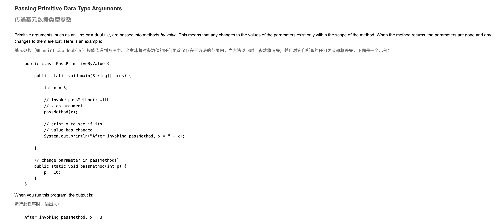
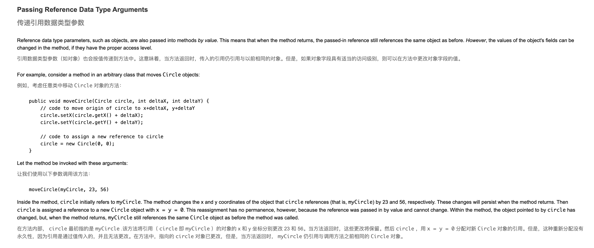

### Field(字段)是 Java 编程语言中类的一个成员，主要用来存储对象的状态（如同某些编程语言中的变量），所以有时也可称为成员字段或成员变量。
### 在类中有下列几种变量（Variable）：
* 1.类中的成员变量，称为字段。
* 2.代码块中的变量，称为局部变量。
* 3.方法和构造方法声明中的变量，称为参数。
### parameter=形参(formal parameter)， argument=实参(actual parameter)。
## OOP概念
* An object is a software bundle of related state and behavior
* (对象是一个相关状态和行为的软件包)
# What Is an Object?
* Real-world objects share two characteristics: They all have state and behavior
* (现实世界的对象有两个共同的特征：它们都有状态和行为。)
*  Dogs have state (name, color, breed, hungry) and behavior (barking, fetching, wagging tail)
* (狗有状态（名字、颜色、品种、饥饿）和行为（吠叫、觅食、摇尾巴）)
*  Bicycles also have state (current gear, current pedal cadence, current speed) and behavior (changing gear, changing pedal cadence, applying brakes)
* (自行车也有状态（当前档位，当前踏板节奏，当前速度）和行为（改变档位，改变踏板节奏，应用刹车）)
* Software objects are conceptually similar to real-world objects: they too consist of state and related behavior
* (软件对象在概念上类似于现实世界的对象：它们也由状态和相关行为组成)
# state
* An object stores its state in fields (variables in some programming languages)
* (对象将其状态存储在字段（某些编程语言中的变量）中)
## Variables (变量)
- 
## 实例变量
* 也叫对象变量、类成员变量
* 从属于类由类生成对象时，才分配存储空间，各对象间的实例变量互不干扰，能通过对象的引用来访问实例变量。
* - 
## 类变量
* 也叫静态变量，用static修饰
* 一个类的静态变量，所有由这类生成的对象都共用这个类变量，类装载时就分配存储空间。一个对象修改了变量，则所以对象中这个变量的值都会发生改变。
- 
## 局部变量
* (方法中或者某局部块中声明定义的变量或方法的参数被称为局部变量，他们只存在于创建他们的block里（{}之间）无法在block外进行任何操作，如读取、赋值。)
* 
## 成员变量、局部变量、静态变量的区别
- 
## Naming(命名)

# behavior
* exposes its behavior through methods (functions in some programming languages)
* (通过方法（某些编程语言中的函数）公开其行为)
* Methods operate on an object's internal state and serve as the primary mechanism for object-to-object communication
* (方法对对象的内部状态进行操作，并充当对象到对象通信的主要机制)
- 
* Hiding internal state and requiring all interaction to be performed through an object's methods is known as data encapsulation — a fundamental principle of object-oriented programming(隐藏内部状态并要求通过对象的方法执行所有交互称为数据封装，这是面向对象编程的基本原则)
- 
# What Is a Class?
* A class is a blueprint or prototype from which objects are created
* (类是用于创建对象的蓝图或原型)
## Declaring Classes(声明类)
- 
# Declaring Member Variables(声明成员变量)
## *Member variables in a class—these are called fields*
* *(类中的成员变量 - 这些变量称为字段)*
### Field declarations are composed of three components, in order
### (字段声明由三个部分组成，按顺序排列)
* Zero or more modifiers, such as public or private(零个或多个修饰符，例如 public 或 private)
### Access Modifiers(访问修饰符)
- 
### 类型
- 
### 变量名称
- 
### Variables in a method or block of code—these are called local variables.
* (方法或代码块中的变量 - 这些变量称为局部变量)
### Variables in method declarations—these are called parameters.
* (方法声明中的变量 - 这些变量称为参数)
## Defining Methods
### More generally, method declarations have six components, in order:(更一般地说，方法声明有六个组件，按顺序排列：)
- 
### method signature
- 
- 
### Naming a Method
- 
### Overloading Methods
- 
## Providing Constructors for Your Classes
- 
### Parameters vs Arguments
- 
### Parameter Types
- 
### Arbitrary Number of Arguments
- 
### Parameter Names
- 
## 面试题
### Passing Primitive Data Type Arguments 
- 
### Passing Reference Data Type Arguments
- 
## Creating Objects
### As you know, a class provides the blueprint for objects; you create an object from a class.
- 
### Declaring a Variable to Refer to an Object
- 
### Instantiating a Class
- 
### Initializing an Object
- 
## Using Objects
### Once you've created an object, you probably want to use it for something. You may need to use the value of one of its fields, change one of its fields, or call one of its methods to perform an action.
### Referencing an Object's Fields
- 
### Calling an Object's Methods
- 
### The Garbage Collector
- 
## More on Classes
### Returning a Value from a Method
- 
### Within an instance method or a constructor, this is a reference to the current object — the object whose method or constructor is being called. You can refer to any member of the current object from within an instance method or a constructor by using this.
### Using this with a Field
- 
### Using this with a Constructor
- 
### Controlling Access to Members of a Class
- 
- 
## Understanding Class Members
### Class Variables 
- 
### Class Methods
- 
### Constants
- 
## Initializing Fields
- 
### Static Initialization Blocks
- 
### Initializing Instance Members
- 
### Summary of Creating and Using Classes and Objects
- 