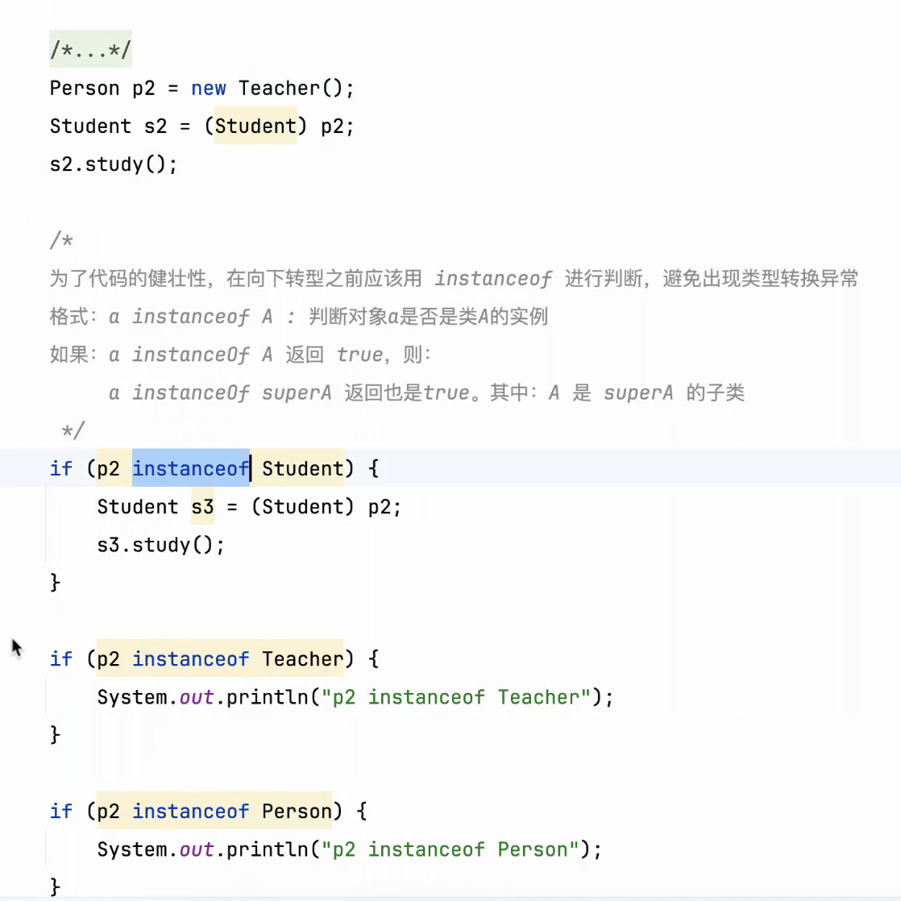
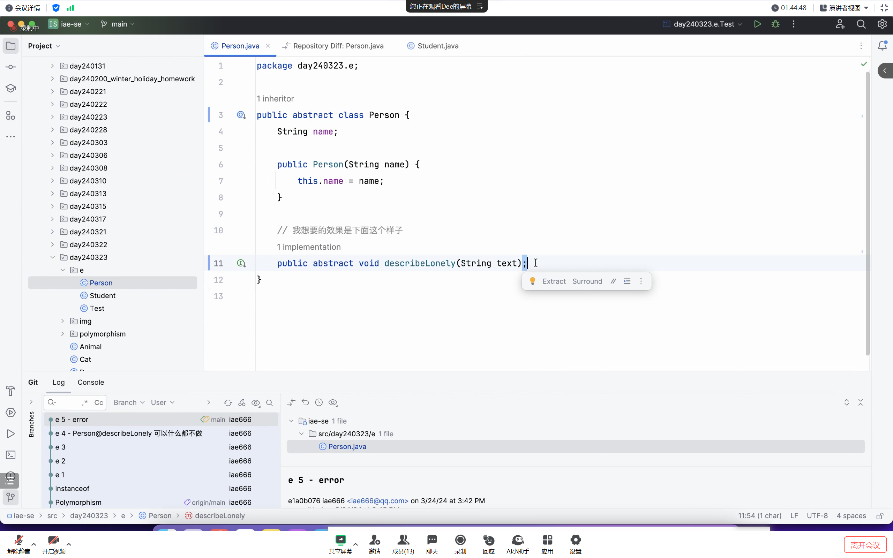
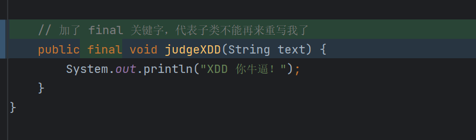
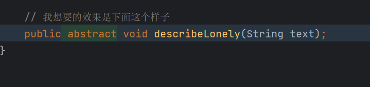
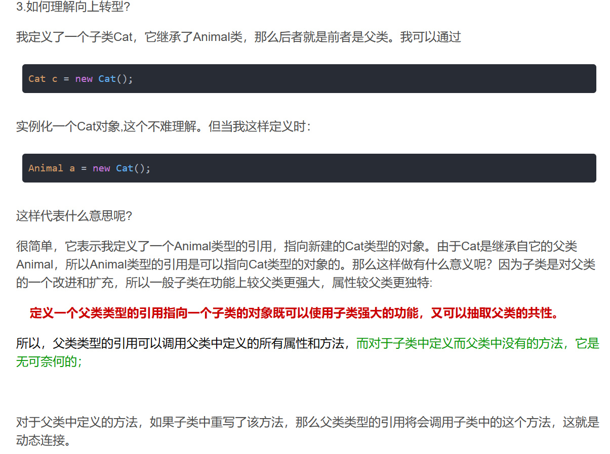

### OOAD 
面向对象分布设计
### Undo commit
撤回提交的commit
### 检查代码格式规范
   
### instanceof检查转化是否异常

### 使用父类类型的引用指向子类的对象

### 父类Person引用子类Student

### 如果instanceof是Dog，return输出

### 类中有抽象的方法，该类的声明的必须是抽象的

### 父类方法加上final关键字则子类无法重写

### 如果方法不想写内容引用abstract关键字

### 定义一个父类类型的引用指向子类对象

### static 不能被子类继承、覆盖