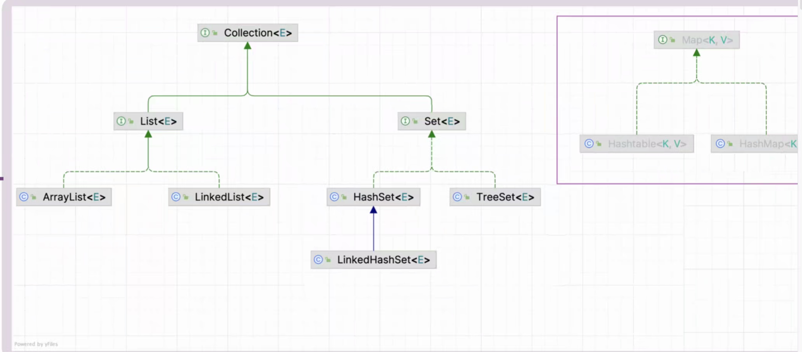

## 多光标ALT+SHIFT+鼠标左键点击
## 包建出来独立成一个包

StringBuild初始new16空间，现版本byte数组，早期char数组 arrayList new出来没有值，赋值以后最低值10，大于10是你赋值的那个值的大小
数组new出来要确定类型和长度
.append在原本的数组上增加新的数组长度

## 字符串拼接StringBuilder性能最好

## 阅读源码的方式
* new看
* 直接sout打印+.toString点进去看
* Debug

## 持久化，之后讲
* 持久化transient，储存用户账号，密码

## 复习
* 排序任何算法
* 排序任何类型
* 今天的例子

## equals
* String new出来比较的是地址值
* equals直接比较字符串值

## 工具类
* Array =>Arrays
* Collection =>Collections

## List
* 不需要修改用ArrayList(数组)
* 修改多用ListedList(链表)

## set
### set的两个重要的特性
* 1.元素不可重复
* 2.无序的
* hashSet无序
* 想要有序TreeSet，但是底层还是无序的

## 没有重写hashCode会自动调用Object类的hashCode

# Map<`K`,`V`>
* `K`不允许重复 (set的特性)
* 之前增加是add(),Map里是put()

## Iterator遍历器