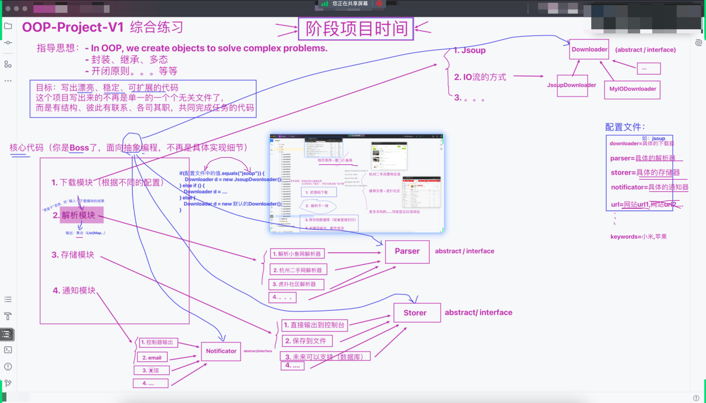
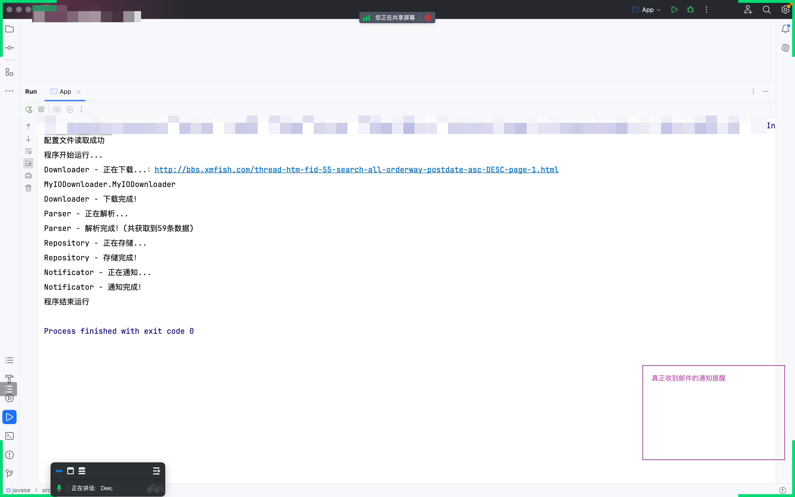
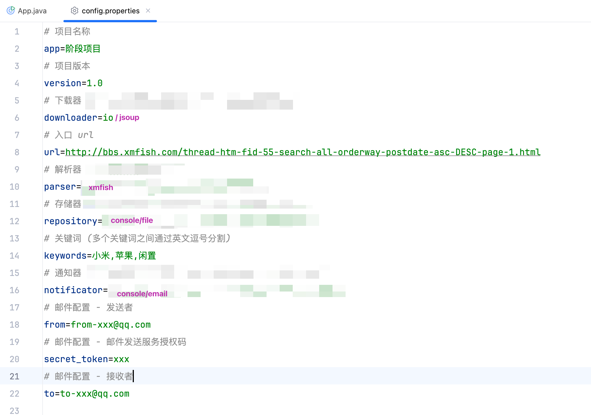
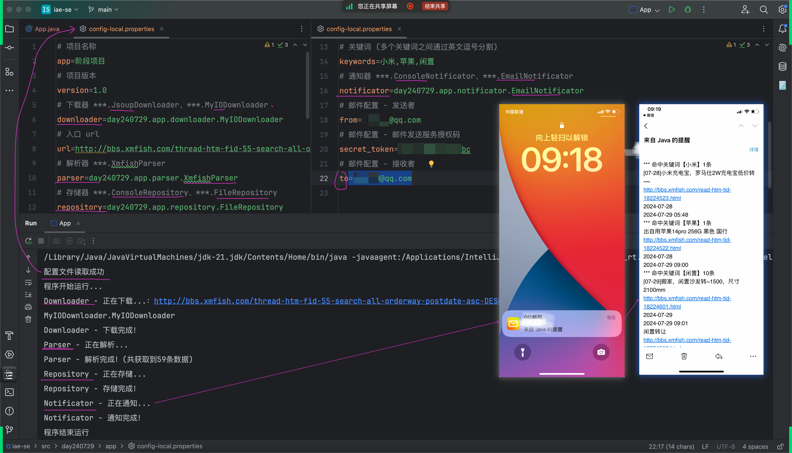
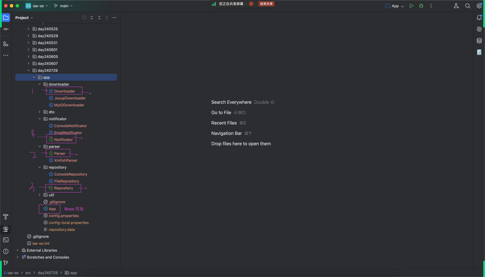
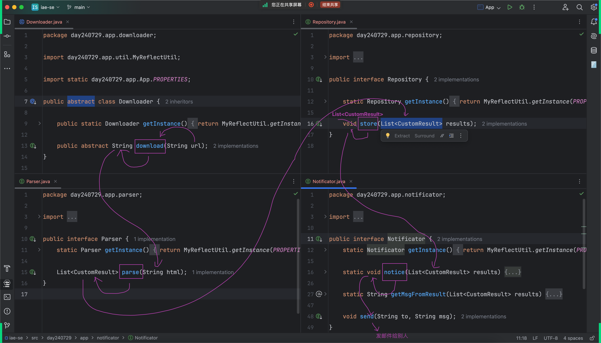
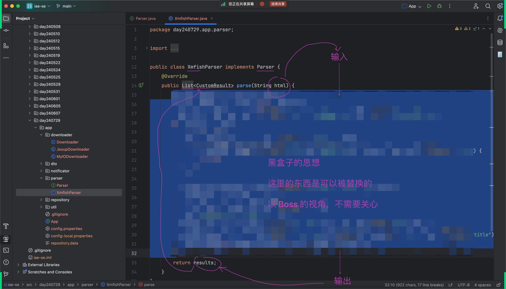

## 项目需求回顾
- 
- 
- 

## 项目完成之后的演示
- 

## 从零开始实现
### 分析及指导思想
- 以`Boss`的视角思考问题，提升`Level`才能达到`漂亮`、`稳定`、`可扩展`
    - 
- 制定/规划出每个模块的`输入`和`输出`
    - 
- `黑盒子`思想
    - 

### 核心步骤
1. 定义xxx规范
2. new出实现类
3. 加入配置文件config.properties读取,将每个模块需要的url,keywords等内容从配置文件中获取
4. 某些操作是不需要由`app`来完成,可以`放权`给别人去做
5. 使用Reflection反射的方式去替代if...else
6. 遵循`DRY`原则，引出`反射`的方式(ReflectUtil)