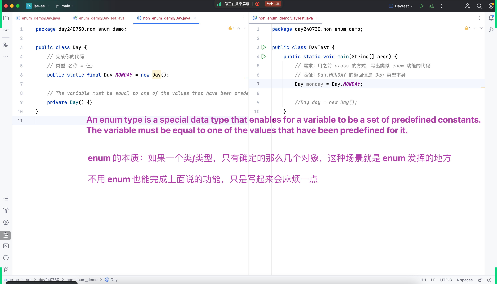

## 看别人代码的方法

1. 如果这个类有main方法，从main方法开始看
2. 如果没有main方法，可以先不看，它肯定是别人在使用它，你可以等在其他代码发现调用它的时候，再看那块逻辑
3. 不要从第一个字母开始看，也不用一下就关注import区域

### 接昨天的内容

- 
- 
- 

## enum类型

- 
- 
- 
- 

### 为什么正常打印对象出现的是地址，但enum可以直接打印值

- 

### 归根到底学习新方法的方式还是老三样

1. 点toString
2. 官方文档
3. 点这个类的特性

- 

### enum的本质

- 如果一个类/类型，只有确定的那么几个对象，这种场景下,这种场景是enum发挥的地方
- 

### enum单例和比较方式
1. equals被重写就比较它里面的值,所以用equals比较只能new出一个类不严谨
2. ==单纯比较两个地址
3. hashcode
- 

### enum不能直接new，但是本身在内部已经new出来了