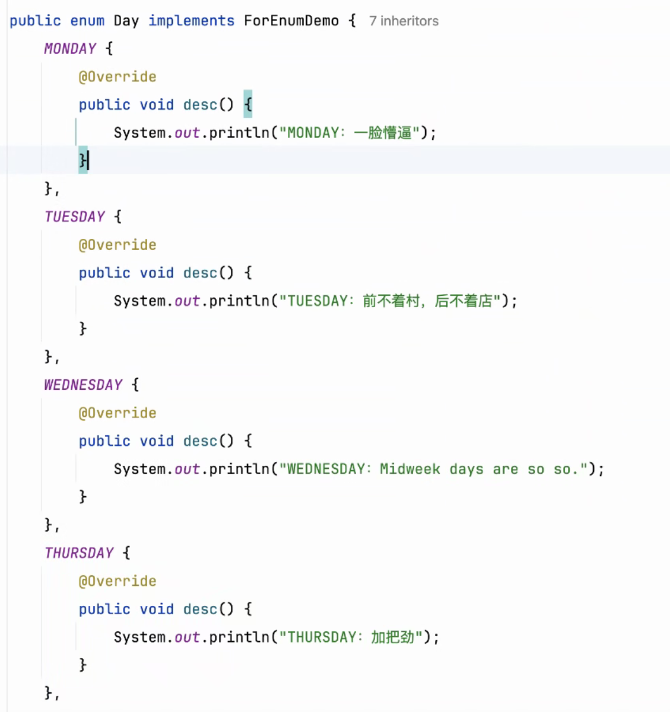
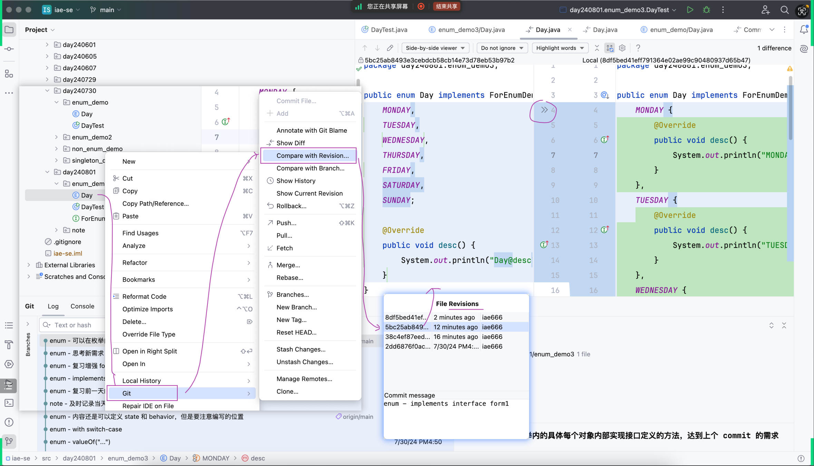
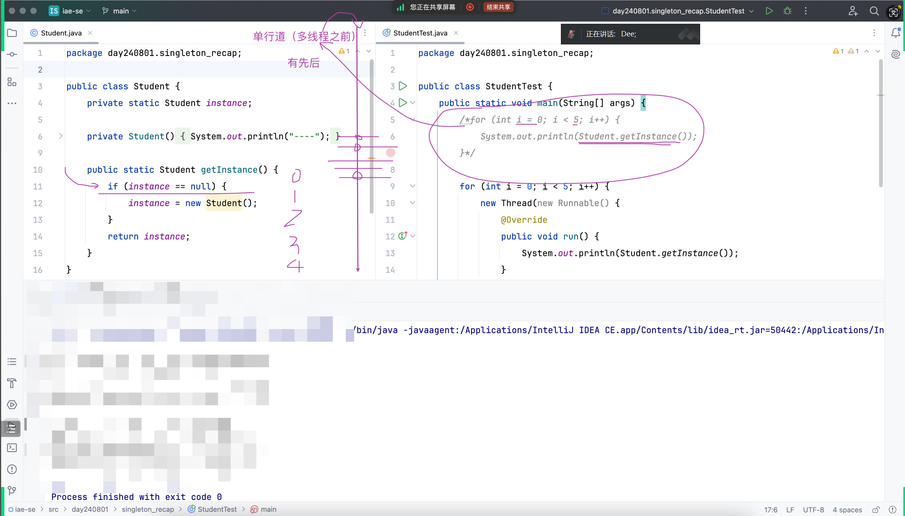
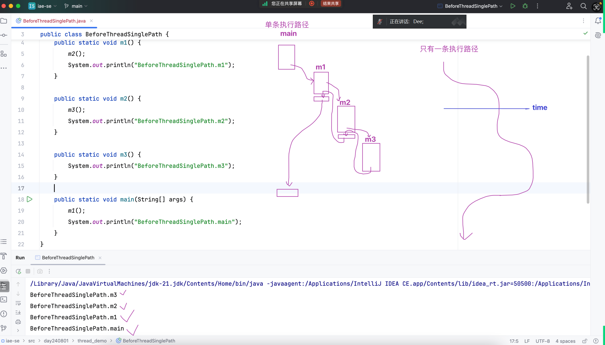
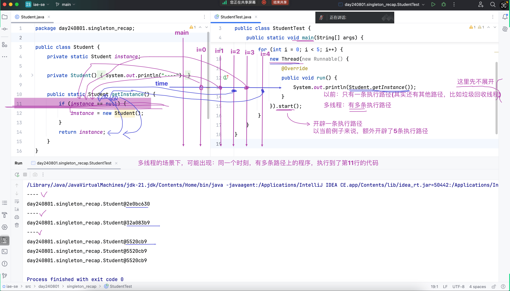
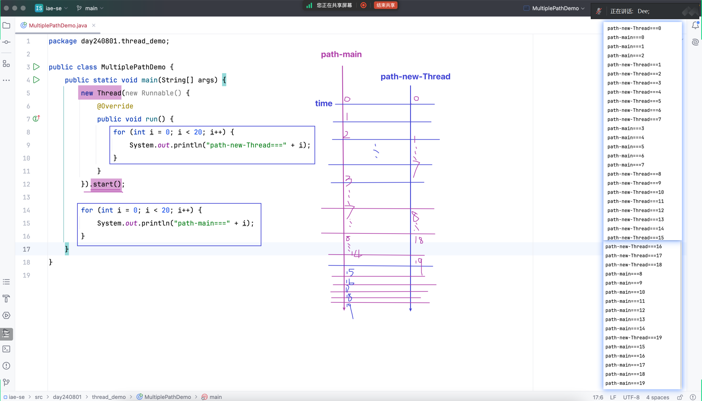
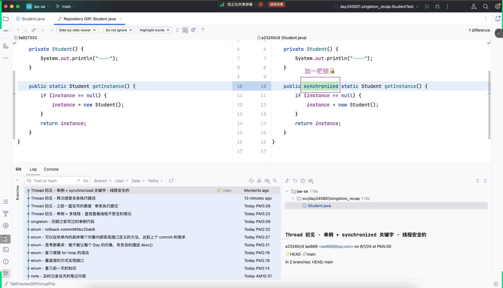
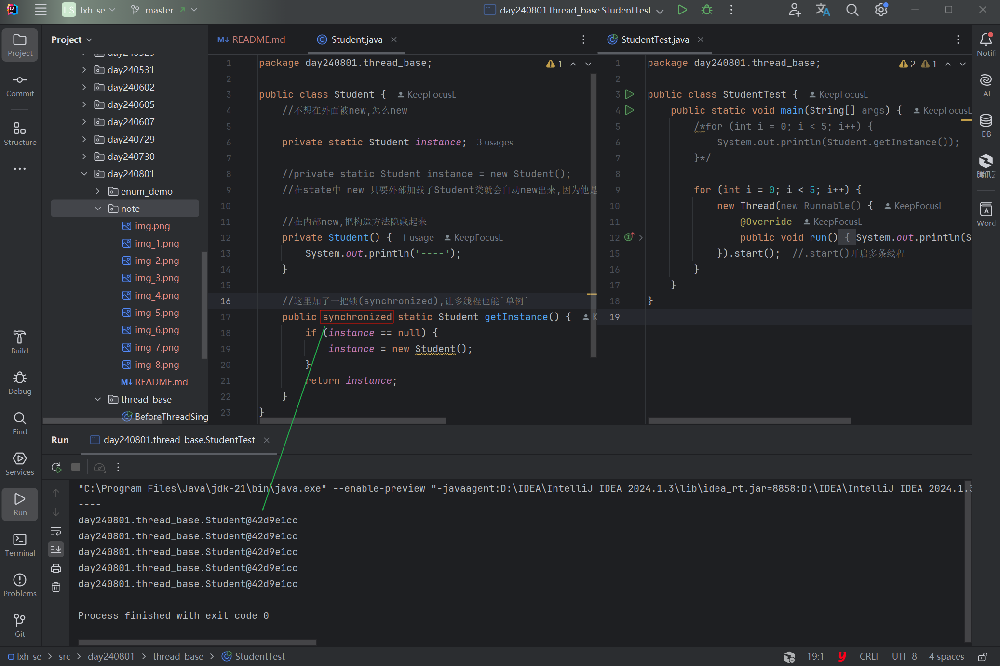

## 今日开篇

- 之前的知识地图,回顾之前的知识

### 暑假阶段课程的总体规划

- 240729:找回写代码的感觉，以假期前布置的阶段项目为例子
- 240730:找回写笔记的感觉(当天的笔记)
- 240801:找回归纳总结的感觉(终点不是当天的内容,而是聚焦在完善整体的知识地图)

### 目的

- 为了后续可以一脚油门踩下去,加快速度

### 泛型

- int --> Integer

### enum继承接口

- 可以在外部(这个类)实现接口定义的方法,也可以从内部(具体对象)实现接口定义的方法,就是定制每一个对象
- 
- 

### 恢复特定commit状态的方式

- 

### 单例 + 多线程 - 直观查看线程不安全的情况

1. 以前:只有`一条`执行路径

- 
- 

2. 多线程:有`多条`执行路径

- new Thread(...).start() 额外开辟新的执行路径
- 

#### 线程的运行 `单线程` vs`多线程`

- 

### 单例 + synchronized 关键字 - 线程安全
- 增加了`synchronized`让在多线程的情况下也能保持`单例`
- 
- 