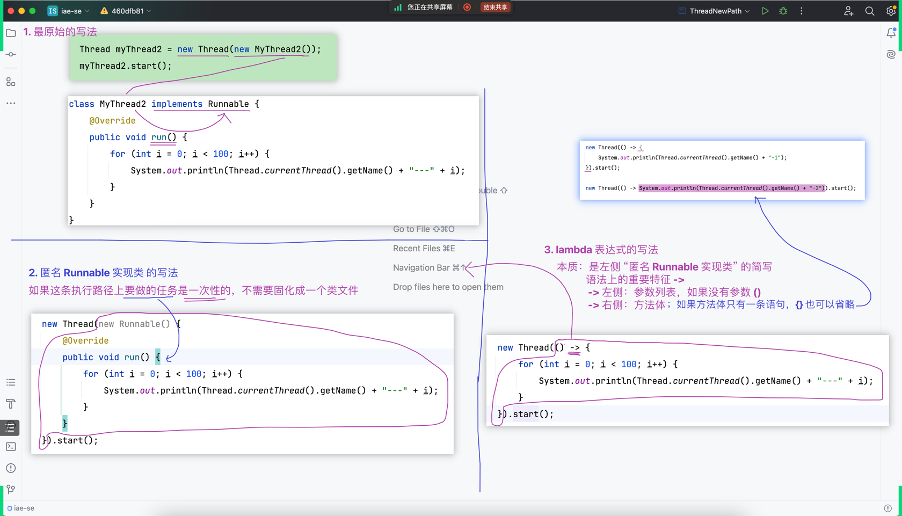
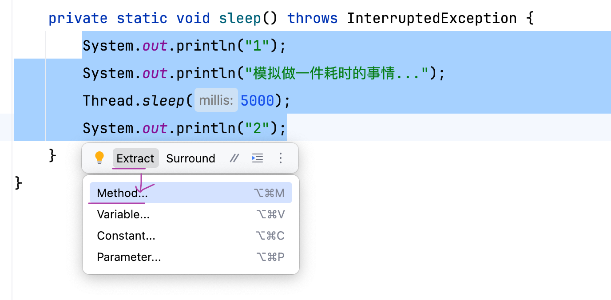
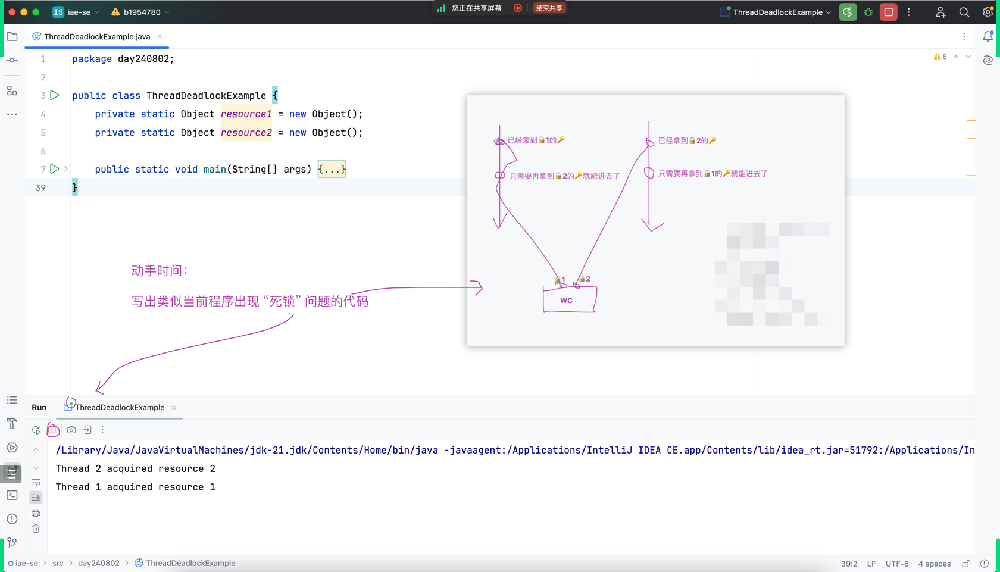

## 回顾

- 见上次课的笔记

## 阅读时间

###

- 中文资料: https://www.ruanyifeng.com/blog/2013/04/processes_and_threads.html
- 英文资料: https://docs.oracle.com/javase/tutorial/essential/concurrency/procthread.html

### 注意点

- 尽信书,不如无书
- 读文章,要抱有怀疑的态度
- 注意翻译的准确度
- 评论区出人才,有评论区多翻翻评论区,可能会有惊喜
- 

## 肉眼可见的一个软件就是一个执行路径(一个进程)

### 直观 `线程` 和 `进程`

- 

### main也是一个执行路径(一个进程)

## Thread Introduction

- 

## Thread 开辟新路径的方式一和方式二

- 

## 给线程指定名字

- 

## Thread - Calls to `run()` vs `start()`

- 

## Thread - 思考：`extends Thread` VS `implements Runnable`

- 

## Thread - `原始的写法` vs `匿名 Runnable 子类` vs `lambda 表达式`

- 

## 小总结

- `线程`简单理解：它就是一条执行路径
- 如何开辟执行路径：`new Thread(...).start();`
- 在这条新开辟的执行路径上要做什么任务：包在 `run` 方法里面

## Thread - 通过控制台的输出直观感受 - 线程状态 - `不确定`

## Thread - 通过阅读源码的方式，看线程的状态 `Thread.State`

## 布置了课后作业

- 

## IDEA 编辑器快速抽取方法的方式

- 选中内容 => hover => 稍等片刻能看到下图
    - 
- 选中内容 => 右击
    - 
- 快捷键的方式，见上图👆

## Thread 常用方法

- `Thread.sleep`
    - 
- `join`
    - 
- `Thread.yield`
    - 
- `setPriority`
    - 
- `isAlive`
    - 

## synchronized

### 直接写在方法声明中

- 

### 锁在更精确的位置上

- 
- 
- 上两张图的 `this` 和 `xxx.class` 可以替换成下图的实现方式
    - 

## 死锁 Deadlock

- 
- 

## TicketWindows 模拟车站买票的场景

- 版本1 - ArrayList
    - 
    - 
- 版本2 - Vector
    - 
    - 
- 版本3 - Vector + Thread.sleep
    - 
- 版本4 - synchronized
    - 
- 版本5 - ConcurrentLinkedQueue
    - 